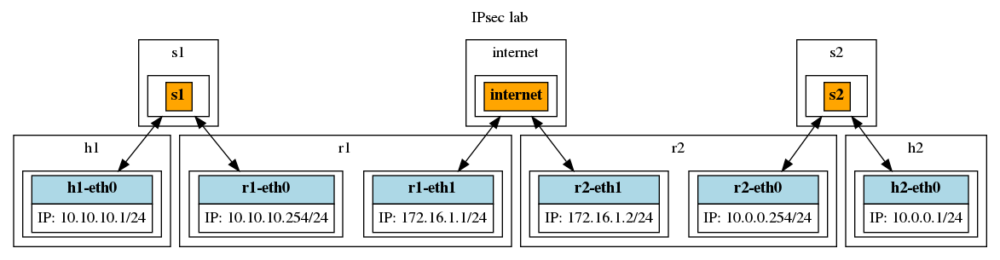
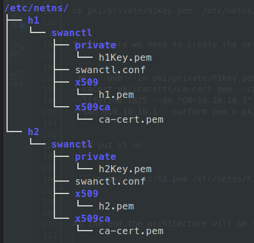

# IPSec

## This writeup intends to outline how the IPSec works 

## What's IPSec ? 

IPsec is a group of protocols that are used together to set up encrypted connections between devices. It helps keep data sent over public networks secure. IPsec is often used to set up ***VPNs***, and it works by encrypting ***IP*** packets, along with ***authenticating*** the source where the packets come from.


## What protocols are used in IPsec?

IPsec is not one protocol, but a suite of protocols. The following protocols make up the IPsec suite:

***Authentication Header (AH)***: The AH protocol ensures that data packets are from a trusted source and that the data has not been tampered with, like a tamper-proof seal on a consumer product. These headers do not provide any encryption; they do not help conceal the data from attackers However todays we don't use this protocol because the ESP can also do authetication of packets and it's less cost.

***Encapsulating Security Protocol (ESP)***: ESP encrypts the IP header and the payload for each packet — unless transport mode is used, in which case it only encrypts the payload. ESP adds its own header and a trailer to each data packet.

***Security Association (SA)***: SA refers to a number of protocols used for negotiating encryption keys and algorithms. One of the most common SA protocols is ***Internet Key Exchange (IKE)***.

Finally, while the Internet Protocol (IP) is not part of the IPsec suite, IPsec runs directly on top of IP.

# Our Architecture 

To show up how Ipsec works we are going to need one network architecture and for that we are unsing [Linux Network Namespaces](https://linuxhint.com/use-linux-network-namespace/).

Therefore we are this architecture 



# Configuration of Ipsec on each Host (h1 and h2)

Firtly we'll set up the IPSec tunnel in static mode without the **IKE protocol** the aims is to build a tunnel between two distances machines
(h1 and h2)

To build the IPsec tunnel we use the command line **ip xfrm**

* ip xfrm state : it'll set up the SA 
* ip xfrm policy : it'll set uo the SP 

Although to set up the tunnel we need four keys:

* 2 keys for SA 
* 2 keys for SPD

to make a key we can use this command line 

```
xxd -p -l 32 -c 32 /dev/urandom
```
or this one 

```
openssl rand -hex
```

# Step 1  generation of keys and ids

we needs to create the follows ids :

* 2 ids for the ***reqid*** to allow the iproute to link the SA with SPD , we'll call these **@RID1 and @RID2**

* 2 ids for the **SPI** we'll call these **@SPI1 and @SPI2**

* 4 keys that we'll call **@K1,@k2,@k3,@k4**

```
K=$(xxd -p -l 32 -c 32 /dev/urandom)
K1="0x${K}"
K=$(xxd -p -l 32 -c 32 /dev/urandom)
K2="0x${K}"
K=$(xxd -p -l 32 -c 32 /dev/urandom)
K3="0x${K}"
K4=$(xxd -p -l 32 -c 32 /dev/urandom)
K4="0x${K}"

Rid=$(xxd -p -l 4 -c 4 /dev/urandom)
Rid1="0x${Rid}"
Rid=$(xxd -p -l 4 -c 4 /dev/urandom)
Rid2="0x${Rid}"

SPI=$(xxd -p -l 4 -c 4 /dev/urandom)
SPI1="0x${SPI}"
SPI=$(xxd -p -l 4 -c 4 /dev/urandom)
SPI2="0x${SPI}"
```

# set up the tunnel 

```
# clean the databases  SAD & SPD

ip netns exec h1 ip xfrm state flush
ip netns exec h1 ip xfrm policy flush 

ip netns exec h2 ip xfrm state flush
ip netns exec h2 ip xfrm policy flush 
```

```

#  AH SAs using 256 bit long and ESP SAs using 32 bit long keys

ip netns exec h1 ip xfrm state add src 10.10.10.1 dst 10.0.0.1 proto esp spi ${SPI1} reqid ${Rid1} mode transport auth sha256 ${K1} enc aes ${K2}
ip netns exec h1 ip xfrm state add src 10.0.0.1 dst 10.10.10.1 proto esp spi ${SPI2} reqid ${Rid2} mode transport auth sha256 ${K3} enc aes ${K4}

ip netns exec h2 ip xfrm state add src 10.10.10.1 dst 10.0.0.1 proto esp spi ${SPI1} reqid ${Rid1} mode transport auth sha256 ${K1} enc aes ${K2}
ip netns exec h2 ip xfrm state add src 10.0.0.1 dst 10.10.10.1 proto esp spi ${SPI2} reqid ${Rid2} mode transport auth sha256 ${K3} enc aes ${K4}

```

```
# Security policies
ip netns exec h2 ip xfrm policy add src 10.10.10.1 dst 10.0.0.1 dir in tmpl src 10.10.10.1 dst 10.0.0.1 proto esp reqid ${Rid1} mode transport
ip netns exec h2 ip xfrm policy add src 10.0.0.1 dst 10.10.10.1 dir out tmpl src 10.0.0.1 dst 10.10.10.1 proto esp reqid ${Rid2} mode transport

ip netns exec h1 ip xfrm policy add src 10.10.10.1 dst 10.0.0.1 dir out tmpl src 10.10.10.1 dst 10.0.0.1 proto esp reqid ${Rid1} mode transport
ip netns exec h1 ip xfrm policy add src 10.0.0.1 dst 10.10.10.1 dir in tmpl src 10.0.0.1 dst 10.10.10.1 proto esp reqid ${Rid2} mode transport

```

After that we can run the tunnel and see whether it works or not , we can sniff with **tcpdump**

```
07:35:08.180009 IP (tos 0x0, ttl 62, id 58897, offset 0, flags [none], proto ESP (50), length 152)                                                                                     
    10.10.10.1 > 10.0.0.1: ESP(spi=0x2546ded7,seq=0x1f), length 132                                                                                                                    
        0x0000:  4500 0098 e611 0000 3e32 7817 0a0a 0a01  E.......>2x.....                                                                                                             
        0x0010:  0a00 0001 2546 ded7 0000 001f f96f 505c  ....%F.......oP\                                                                                                             
        0x0020:  90ee 6084 43b6 8652 7556 1593 c70f 01e3  ..`.C..RuV......                                                                                                             
        0x0030:  9252 2a3d 0611 a730 d2dc acb2 6972 acb9  .R*=...0....ir..                                                                                                             
        0x0040:  9212 ab83 82b2 4a91 a946 8760 3407 c6d5  ......J..F.`4...                                                                                                             
        0x0050:  f29e 6b4e 32a5 bbea b638 751e 3c8f 689f  ..kN2....8u.<.h.                                                                                                             
        0x0060:  4c13 1dbd 7c5a 948c 41a2 1547 c187 84ed  L...|Z..A..G....                                                                                                             
        0x0070:  2a93 4f15 1b02 3fa3 d210 a5f2 ac15 72ba  *.O...?.......r.
        0x0080:  972c 1478 19c3 c984 1029 5000 6d62 2901  .,.x.....)P.mb).
        0x0090:  9d04 0103 d68d df0a  
```

# What is the difference between IPsec tunnel mode and IPsec transport mode?

IPsec tunnel mode is used between two dedicated routers, with each router acting as one end of a virtual "tunnel" through a public network. In IPsec tunnel mode, the original IP header containing the final destination of the packet is encrypted, in addition to the packet payload. To tell intermediary routers where to forward the packets, IPsec adds a new IP header. At each end of the tunnel, the routers decrypt the IP headers to deliver the packets to their destinations.

In transport mode, the payload of each packet is encrypted, but the original IP header is not. Intermediary routers are thus able to view the final destination of each packet — unless a separate tunneling protocol (such as GRE) is used.

# Using  IKE  with StrongSwan

What's IKE 

 is a VPN encryption protocol . It secures the traffic by establishing and handling the SA (Security Association) attribute within IPSec. It creates a secure tunnel between the VPN client and VPN server by authenticating both the client and the server by choosing which encryption method will be used.

Although  **StrongSawn** it is an open source IPsec VPN solution that implement the key exchange protocols.

First of all  we need to install this all tools:

```
sudo apt install strongswan strongswan-pki libcharon-extra-plugins \
libcharon-extauth-plugins strongswan-swanctl charon-systemd
```

## step 1 

let's set up two **pki** on **h1** and on **h2** to generate the certificats so that **StrongSwan** has the advantage to have a little **pki** that we can use to create the certificats.

create the **pki** using these commands lines 

```
$ mkdir -p pki/{cacerts,certs,private}
$ pki --gen --type rsa --size 4096 --outform pem > pki/private/ca-key.pem
$ pki --self --ca --lifetime 3650 --in pki/private/ca-key.pem \
--type rsa --dn "CN=VPN root CA" --outform pem > pki/cacerts/ca-cert.pem
```

The first line will create the repositoris (cacerts,certs and private) on  **pki** folder , however the option **ca-key.pem** will create a RSA key and the one with **ca-cert.pem** a certificat that belong to the **CA**.

Next we're goin to copy the **CA** certificat on these folders

```
cp pki/cacerts/ca-cert.pem  /etc/netns/h1/swanctl/x509ca/
cp pki/cacerts/ca-cert.pem  /etc/netns/h2/swanctl/x509ca/
```

Once the **PKI** is working we can use it to generate the certificats but first
lets create the secr3t key for **h1**

```
pki --gen --type rsa --size 4096 --outform pem > pki/private/h1Key.pem
```

And put it on 

```
cp pki/private/h1Key.pem  /etc/netns/h1/swanctl/private
```

furthermore we need to create the certificats for each host **h1 et h2**

 ```
 pki --pub --in pki/private/h1Key.pem --type rsa | pki --issue \
--cacert pki/cacerts/ca-cert.pem --cakey pki/private/ca-key.pem \
--lifetime 1825 --dn "CN=10.10.10.1" --san 10.10.10.1 \
--san @10.10.10.1 --outform pem > pki/certs/h1.pem
 ```

 and put it on 

 
 ```cp pki/certs/h1.pem /etc/netns/h1/swanctl/x509
 ```


At the end the architecture will be like that :





 ## step 2  configurate the two side of tunnel host-to-host with IKE 


first of all we need to create swanctl.conf for both sides (h1 and h2) with this content (for h1 )

```
connections {
    host-host {
        remote_addrs = 10.0.0.1
        local {
            auth=pubkey
            certs=h1.pem
        }
        remote {
            auth= pubkey
            id= "CN=10.0.0.1"
        }
        children {
            net-net {
                start_action =trap 
            }
        }
    }
}
```
and place it on 
```
cp swanctl.conf /etc/netns/h1/swanctl/
```

after that we can build the tunnel as we are using the **netns** , we'll do that :

```
$ sudo ip netns exec h1 bash
$ sudo killall charon
$ sudo killall starter
$ sudo mkdir /tmp/h1
$ sudo mount --bin /tmp/h1 /run
$ sudo ipsec start
$ swanctl --load-creds
$ swanctl --load-conn
```

the command **swanctl --load-creds** allows to load the certificates 
the command **swanctl --load-cons** aloows to start the connexion 


## Step 3  set up the IPSec tunnel  between the two hosts (h1 and h2)
The tunnel will be set up between **r1 and r2** then to start we need to create the **RSA key** and the certificats for both.

Create the secr3t RSA key 

```
pki --gen --type rsa --size 4096 --outform pem > pki/private/r1Key.pem
```
Create the certificate 

```
pki --pub --in pki/private/r1Key.pem --type rsa | pki --issue --cacert pki/cacerts/ca-cert.pem --cakey pki/private/ca-key.pem --lifetime 1825 --dn "CN=172.16.1.1"   --san 172.16.1.1   --san @172.16.1.1   --outform pem > pki/certs/r1.pem
```

# Configuration Road Warrior


# References 

* https://github.com/strongswan/strongswan